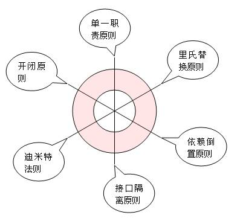

# 设计模式(Design Pattern)

设计模式研究和学习，Design Pattern study and learn。

## 设计模式

[设计模式（design pattern）](https://zh.wikipedia.org/wiki/设计模式_(计算机))是对软件设计中普遍存在的各种问题，所提出的解決方案。

## 六大设计原则

* 单一职责原则
  > 定义：不要存在多于一个导致类变更的原因
* 里氏替换原则
  > 定义1：如果对每一个类型为T1的对象o1，都有类型为T2的对象02，使得以T1定义的所有程序P在
  > 所有的对象o1都替换成o2时，程序P的行为没有发生变化，那么类型T2是类型T1的子类型。
  > 定义2：所有引用基类的地方必须能透明地使用其子类对象。
* 依赖倒置原则
  > 定义：高层模块不应该依赖低层模块，二者都应该依赖其抽象；抽象不应该依赖细节；细节应该依赖抽象。
* 接口隔离原则
  > 定义：客户端不应该依赖它不需要的接口；一个类对另一个类的依赖应该建立在最小的接口上。
* 迪米特法则
  > 定义：一个对象应该对其他对象保持最少的了解。
* 开闭原则
  > 定义：一个软件实体如类、模块和函数应该对扩展开放，对修改关闭。

## 设计模式分类

设计模式一般分为创建型模式、结构型模式和行为型模式。

### 创建型模式

[抽象工厂模式](https://www.runoob.com/design-pattern/abstract-factory-pattern.html)
[工厂方法模式](https://www.runoob.com/design-pattern/factory-pattern.html)
[建造者模式](https://www.runoob.com/design-pattern/builder-pattern.html)
[原型模式](https://www.runoob.com/design-pattern/prototype-pattern.html)
[单例模式](https://www.runoob.com/design-pattern/singleton-pattern.html)
[惰性初始模式](https://zh.wikipedia.org/wiki/惰性初始模式)
[对象池模式](https://zh.wikipedia.org/wiki/对象池模式)

### 结构型模式

[适配器模式](https://www.runoob.com/design-pattern/adapter-pattern.html)
[桥接模式](https://www.runoob.com/design-pattern/bridge-pattern.html)
[过滤器模式](https://www.runoob.com/design-pattern/filter-pattern.html)
[组合模式](https://www.runoob.com/design-pattern/composite-pattern.html)
[装饰模式](https://www.runoob.com/design-pattern/decorator-pattern.html)
[外观模式](https://www.runoob.com/design-pattern/facade-pattern.html)
[享元模式](https://www.runoob.com/design-pattern/flyweight-pattern.html)
[代理模式](https://www.runoob.com/design-pattern/proxy-pattern.html)

### 行为型模式

[责任链模式](https://www.runoob.com/design-pattern/chain-of-responsibility-pattern.html)
[命令模式](https://www.runoob.com/design-pattern/command-pattern.html)
[迭代器模式](https://www.runoob.com/design-pattern/iterator-pattern.html)
[中介者模式](https://www.runoob.com/design-pattern/mediator-pattern.html)
[观察者模式](https://www.runoob.com/design-pattern/observer-pattern.html)
[策略模式](https://www.runoob.com/design-pattern/strategy-pattern.html)
[模板方法模式](https://www.runoob.com/design-pattern/template-pattern.html)
[访问者模式](https://www.runoob.com/design-pattern/visitor-pattern.html)
[备忘录模式](https://www.runoob.com/design-pattern/memento-pattern.html)
[解释器模式](https://www.runoob.com/design-pattern/interpreter-pattern.html)
[状态模式](https://www.runoob.com/design-pattern/state-pattern.html)
[空对象模式](https://www.runoob.com/design-pattern/null-object-pattern.html)
