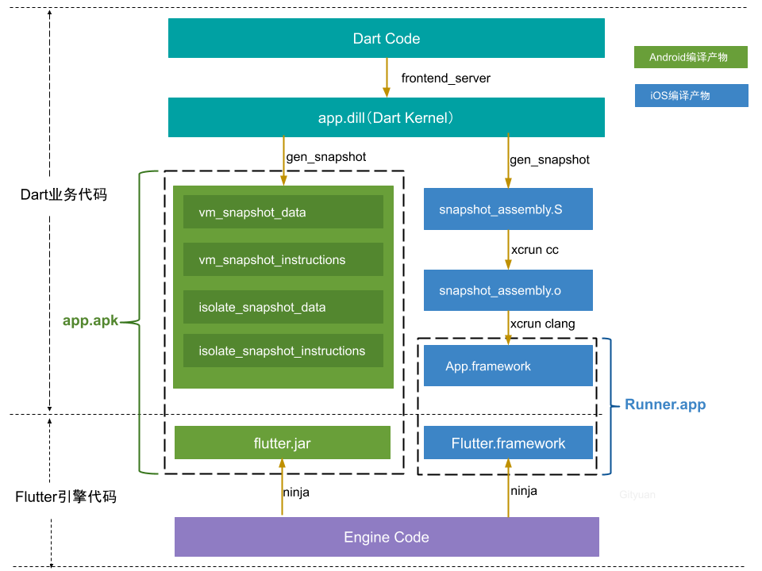
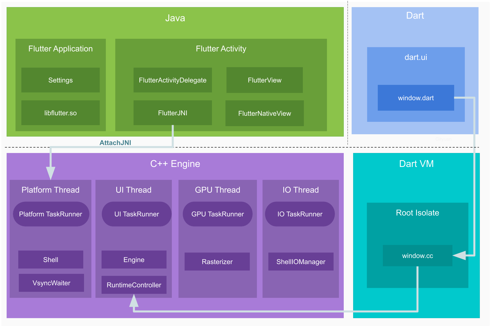
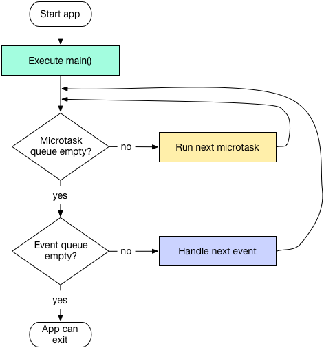
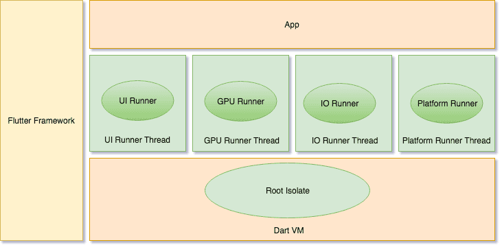

# Flutter技术架构(Flutter Architecture)

Flutter技术架构研究和学习，Flutter technology architecture study and learn

## Flutter技术架构概览

* Embedder是一个嵌入层，即把Flutter嵌入到各个平台上去，这里做的主要工作包括渲染Surface设置，线程设置，以及插件等。 从这里可以看出，Flutter的平台相关层很低，平台(如iOS)只是提供一个画布，剩余的所有渲染相关的逻辑都在Flutter内部，这就使得它具有了很好的跨端一致性
* Engine 是Flutter的核心，它主要是用C++编写的，并支持所有Flutter应用程序所必需的原语。每当需要绘制新界面时，引擎负责对合成场景进行栅格化。它提供了Flutter核心API的低级实现，包括图形（通过Skia），文本布局，文件和网络I / O，可访问性支持，插件架构以及Dart运行时和编译工具链
* Framework使用dart实现，包括Material Design风格的Widget, Cupertino(针对iOS)风格的Widgets，文本/图片/按钮等基础Widgets，渲染，动画，手势等。此部分的核心代码是: flutter仓库下的flutter package，以及flutter/engine仓库下的io, async, ui(dart:ui库提供了Flutter框架和引擎之间的接口)等package

## Flutter编译产物

## Flutter引擎启动

### 引擎启动过程

* FlutterApplication.java的onCreate方法完成初始化配置，加载引擎libflutter.so文件，注册JNI([Java Native Interface，Java本地接口](https://zh.wikipedia.org/wiki/Java本地接口))方法
* FlutterActivity.java的onCreate过程，通过Flutter JNI的AttachJNI方法来初始化引擎Engine、Dart虚拟机、isolate线程、taskRunner等对象。再经过层层处理最终调用main.dart中的`main()`方法，执行runApp(Widget app)来处理整个Dart业务代码

### Flutter引擎中的TaskRunner

#### TaskRunner原理

Flutter引擎启动过程中，会创建UI线程，GPU线程和IO线程，Flutter引擎会为这些线程依次创建MessageLoop对象，启动后处于epoll_wait等待状态。

Flutter任务队列分为event queue(事件队列)和microtask queue(微任务队列)，事件队列包含所有的外部事件，如Flutter引擎和Dart虚拟机的事件以及Future。Dart层执行 scheduleMicrotask() 所产生的属于Microtask微任务。
从上面的流程图可以看出，当main()执行完了之后，事件循环就开始工作。首先，它会以FIFO的顺序，执行所有的微任务。然后事件队列的第一项任务第一项出队并开始处理。然后重复该循环：执行所有的微任务，然后处理事件队列的下一项。

#### 四个TaskRunner

* Platform Task Runner: 运行在Android或者iOS的主线程，尽管阻塞该线程并不会影响Flutter渲染管道，平台线程建议不要执行耗时操作；否则可能出发watchdog来结束该应用。比如Android、iOS都是使用平台线程来传递用户输入事件，一旦平台线程被阻塞则会引起手势事件丢失
* UI Task Runner: 运行在ui线程，比如1.ui，用于引擎执行root isolate中的所有Dart代码，执行渲染与处理vsync信号，将widget转换生成Layer Tree。除了渲染之外，还有处理Native Plugins消息、Timers、Microtasks等工作
* GPU Task Runner: 运行在gpu线程，比如1.gpu，用于将Layer Tree转换为具体GPU指令，执行设备GPU相关的skia调用，转换相应平台的绘制方式，比如OpenGL, vulkan, metal等。每一帧的绘制需要UI Runner和GPU Runner配合完成，任何一个环节延迟都可能导致掉帧
* IO Task Runner: 运行在io线程，比如1.io，前3个Task Runner都不允许执行耗时操作，该Runner用于将图片从磁盘读取出来，解压转换为GPU可识别的格式后，再上传给GPU线程。为了能访问GPU，IO Runner跟GPU Runner的Context在同一个ShareGroup。比如ui.image通过异步调用让IO Runner来异步加载图片，该线程不能执行其他耗时操作，否则可能会影响图片加载的性能

## 🔭 学习更多

* [Flutter 跨平台演进及架构开篇](http://gityuan.com/flutter/)
* [为追求高性能，我必须告诉你Flutter引擎线程的事实](https://zhuanlan.zhihu.com/p/38026271)
* [Flutter architecture overview](https://flutter.dev/docs/resources/architectural-overview)
* [The Event Loop and Dart](https://web.archive.org/web/20170704074724/https://webdev.dartlang.org/articles/performance/event-loop)
